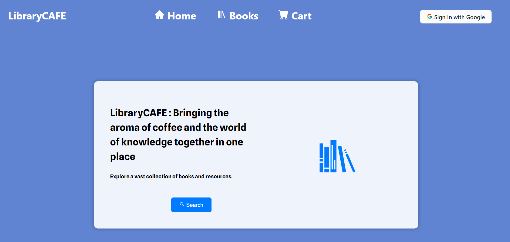

# Library Management Project



Welcome to our Library Management Project repository, a collaborative effort by three dedicated team members. This project is designed to help you manage and rent books from a digital library, making your reading experience more convenient and accessible. Read on to learn more about the project and how to run it on your local device.

## Collaborators

Meet the team members who contributed to this project:

1. [Madhur Agarwal](https://github.com/AgarwalMaddy)
   - Role: Project Lead
   - Contact: madhur1812agarwal@gmail.com

2. [Priyanshu Dhapodkar](https://github.com/priyanshu070702)
   - Role: Frontend Developer
   - Contact: priyanshu.dhapodkar2020@vitbhopal.ac.in

3. [Ayush Bhatt](https://github.com/alternateAyush)
   - Role: Backend Developer
   - Contact: ayush.bhatt2020@vitbhopal.ac.in

## About the Project

Our Library Management System is a web-based application that allows you to view and rent out different books from our library. The books are fetched from a custom-built API, created by one of our team members. Here are some key features of the project:

- Browse and search for books from our digital library.
- View detailed information about each book, including the author, publication date, and a brief description.
- Rent out books and keep track of your reading history.
- Secure user authentication and registration powered by Firebase.
- [Live Link](https://dev-rev-task-lilac.vercel.app/)

## Getting Started

To run this project on your local device, follow these steps:

1. **Clone the repository:**
[Clone the repository](https://github.com/AgarwalMaddy/Dev-Rev-Task.git)


2. **Install Dependencies:**
- Make sure you have Node.js and npm (Node Package Manager) installed on your machine.
- Navigate to the project root directory and run the following commands:
  ```
  cd frontend
  npm install
  cd ../backend
  npm install
  ```

3. **Configure Firebase:**
- Set up a Firebase project and obtain your Firebase configuration.
- Create a `.env` file in the `backend` directory and add your Firebase configuration as follows:
  ```env
  FIREBASE_API_KEY=your-api-key
  FIREBASE_AUTH_DOMAIN=your-auth-domain
  FIREBASE_PROJECT_ID=your-project-id
  FIREBASE_STORAGE_BUCKET=your-storage-bucket
  FIREBASE_MESSAGING_SENDER_ID=your-messaging-sender-id
  FIREBASE_APP_ID=your-app-id
  ```

4. **Start the Application:**
- In the project root directory, start both the frontend and backend servers:
  ```
  cd frontend
  npm start
  ```
  ```
  cd backend
  npm start
  ```

5. The application should now be running locally. Open your web browser and access [http://localhost:3000](http://localhost:3000) to explore the Library Management System.

## Technologies Used

This project is built using the following technologies:

- **Frontend**: ReactJS
- **Backend**: Node.js
- **Authentication**: Firebase

Feel free to explore, contribute, and enhance this Library Management Project. If you have any questions or encounter issues, please don't hesitate to reach out to any of the collaborators.

Happy reading!
